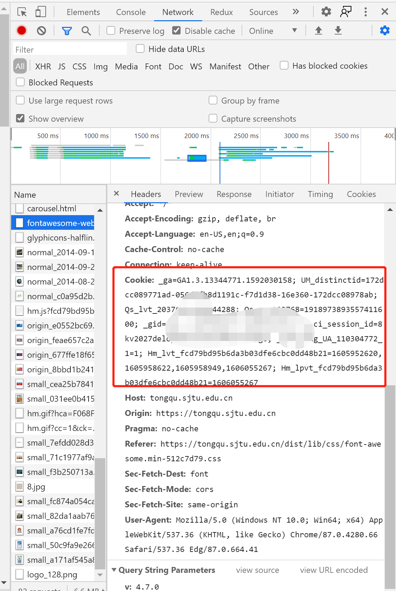

### 同去网抢献血名额程序

使用方式：先配置`json`文件，然后`go run main.go`， 如果使用python方式，请使用`python tongqu.py`，或者到[Release界面](https://github.com/junhaideng/go-crawler-example/releases)下载可执行文件exe

> 注意`config.json`和代码文件(`tongqu.go or tongqu.py`)应该在同一个目录夹下

在`config.json`中配置对应的信息，如下

```json
{
  "data":{
    "act_id": "xxx",
    "user_sign_info":{
        "info": [
            "学院",
            "出生日期",
            "第几次献血",
            "是否是留学生"
        ],
        "name": "xx",
        "phone": "xxx",
        "email": "xxx@sjtu.edu.cn",
        "student_number": "xxx"
    },
    "attach_id":"0"
  },
  "cookie": "xxxx"
}
```

以网站` https://tongqu.sjtu.edu.cn/act/24643`为例

看网站连接，我们可以获取到对应的`act_id=24643`，不同的献血时间段也会对应不同的id

`user_sign_info`是你的个人信息，依次是`学院`、`出生日期`、`第几次献血`、`是否是留学生`

`name`填姓名，`phone`对应手机号，`email`对应邮箱，请使用`sjtu邮箱`，`student_number`对应学号

`attach_id`统一为0

cookie 在同去网登录之后，打开开发者工具(F12或者`ctrl+shift+I`)，


